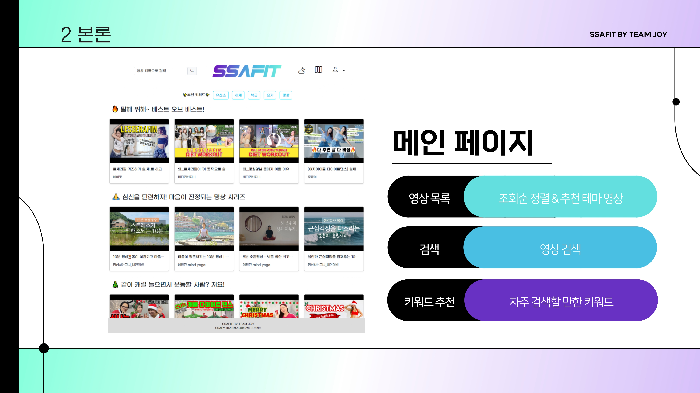
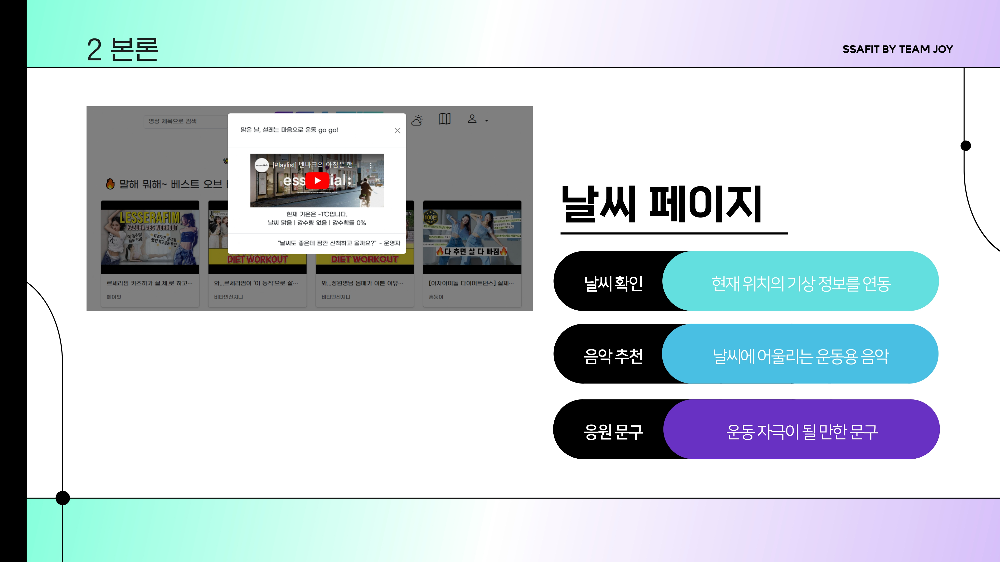
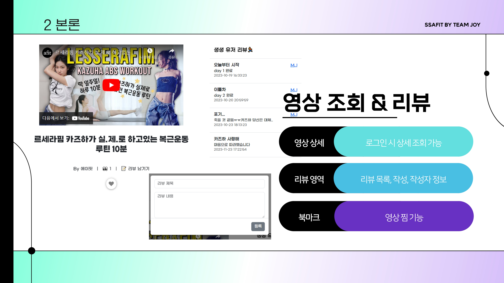
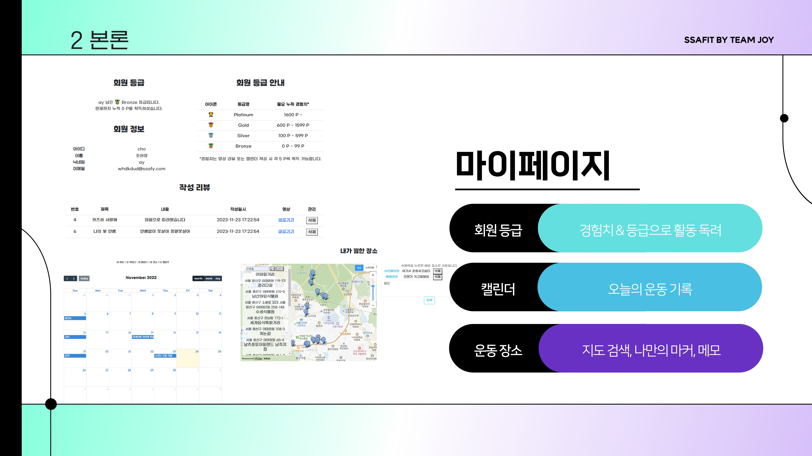
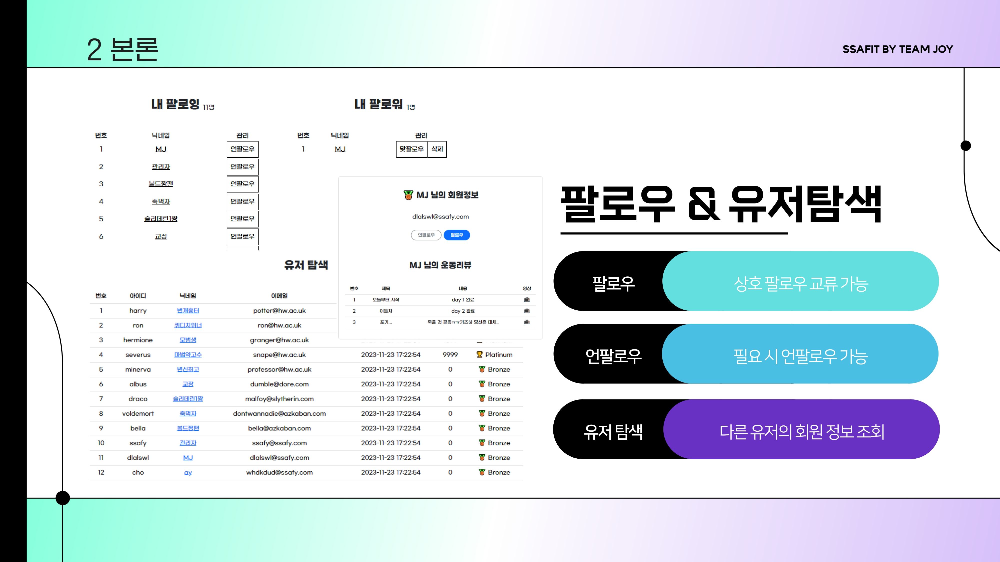
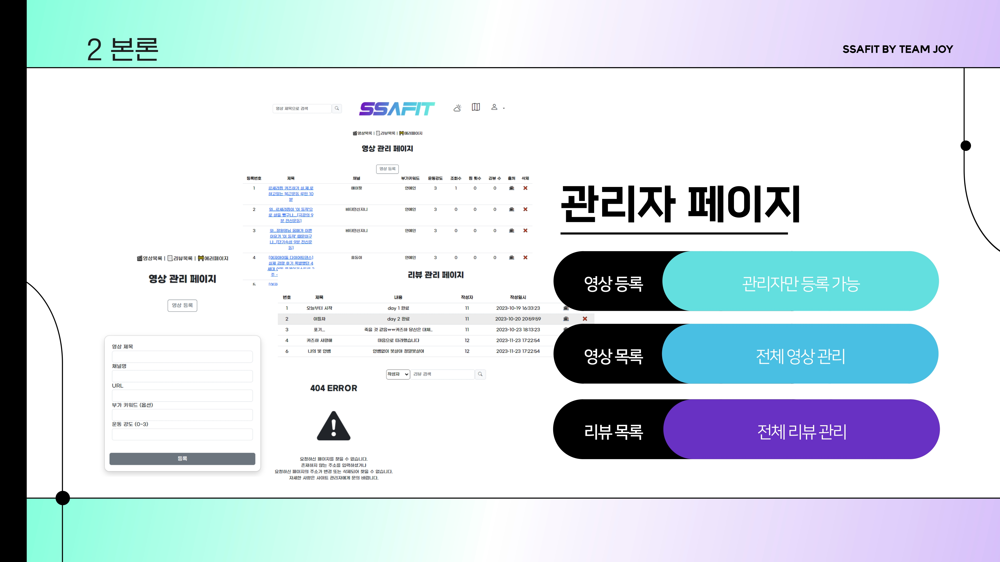

# SSAFIT
운동 영상 사이트

# 프로젝트 기간
2023.11.16 ~ 23.11.24(9일)

# Tech Stack
 
 

# 팀원 소개
<table>
 <tr>
    <td align="center"></td>
    <td align="center"></td>
  </tr>
  <tr>
    <td align="center"><a href="https://github.com/namoo1818"><b>이민지</b></a></td>
    <td align="center"><a href="https://github.com/aycho00"><b>조아영</b></a></td>
  </tr>
</table>

# 주요 기능
[!메인페이지] 
[!날씨페이지] 
[!회원가입_로그인페이지] 
[!영상조회페이지] 
[!마이페이지] 
[!팔로우_유저목록페이지] 
[!관리자페이지] 